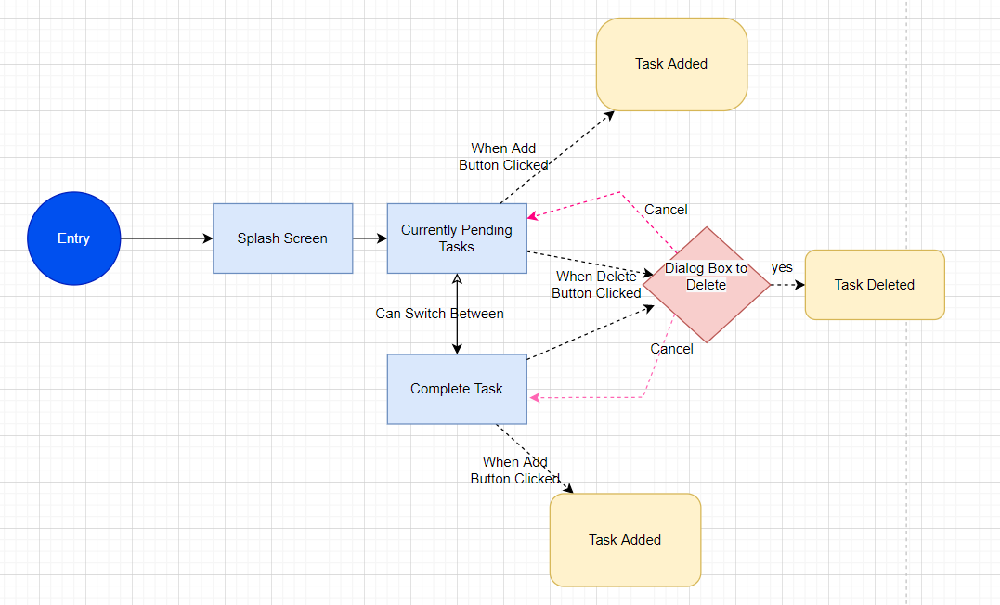

# Todo App

Flutter application made for adding task and their description and seeing 
whether a task has been completed or not

## User Flow Diagram and Description

## Use Cases and description
Todo App made with SQL Lite and flutter to create a mobile task list.
 
#### 1. User should be able to see the description and title of his task. ####
#### 2. User should be able to see which tasks are complete or in progress. ####
#### 3. User should be able to see mark his tasks as done. ####
#### 4. User should be able to add/delete his task. ####
#### 5. User should be able to edit/update the description and title of his task. ####
#### 6. User should be able to see the completion time of his task and be able to set it . ####

## Video defining the use cases one by one

